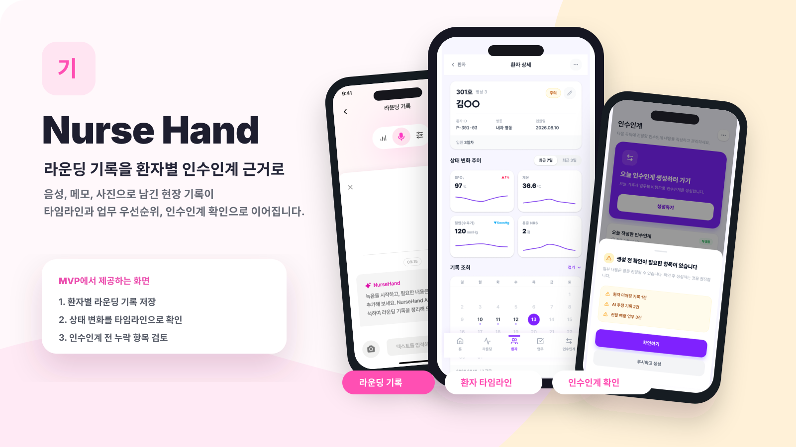

<h1 align="center">Nurse Hand</h1>

  교대근무 간호사의 환자 파악부터 업무 우선순위, 인수인계 누락 검증까지 돕는 AI 업무 보조 서비스

  <a href="https://github.com/Nurse-Hand/client">Client</a>
  ·
  <a href="https://github.com/Nurse-Hand/server">Server</a>
  ·
  <a href="https://github.com/Nurse-Hand/ai">AI</a>

---

## 핵심 문제

간호사는 매 근무마다 처방, 협진, 간호기록, 전 근무 인수인계처럼 흩어진 정보를 다시 찾아 비교해야 합니다. Nurse Hand는 한 번 남긴 라운딩 기록을 환자별 타임라인, 업무 우선순위, 인수인계 초안과 누락 검증으로 이어지게 만들어 반복 확인과 기록 부담을 줄입니다.

## MVP Flow

| 단계 | 앱 화면 | 핵심 동작 | 연결 API |
| --- | --- | --- | --- |
| 1 | 홈 · 라운딩 시작 | 오늘 근무와 담당 환자를 확인하고 라운딩 세션을 시작합니다. | `POST /api/v1/rounding-sessions` |
| 2 | 라운딩 기록 중 | 음성, 텍스트, 사진으로 현장 기록을 남기고 환자 구간을 나눕니다. | `POST /api/v1/rounding-sessions/{sessionId}/records`, `POST /api/v1/rounding-sessions/{sessionId}/audio-chunks` |
| 3 | 기록 종료 · 저장 | 라운딩 종료 시 녹음 파일과 세션 상태를 저장하고 분석 흐름으로 넘깁니다. | `POST /api/v1/files/audio`, `POST /api/v1/rounding-sessions/{sessionId}/complete` |
| 4 | 환자 타임라인 | 기록을 환자별로 모아 시간순 변화와 AI 요약을 확인합니다. | `GET /api/v1/rounding-records`, `GET /api/v1/patients/{patientId}/timeline` |
| 5 | 업무 우선순위 | 담당 환자 업무를 기한과 근거 중심으로 정리하고 우선순위를 확정합니다. | `GET /api/v1/tasks`, `POST /api/v1/task-extraction-jobs` |
| 6 | 인수인계 검증 | 라운딩 기록과 타임라인을 바탕으로 초안을 만들고 누락 가능 항목을 확인합니다. | `POST /api/v1/handoff-prechecks`, `POST /api/v1/handoffs`, `POST /api/v1/handoffs/{handoffId}/finalize` |

## Core Features

| 기능 | 무엇을 돕나 |
| --- | --- |
| 멀티모달 라운딩 기록 | 라운딩 중 음성, 텍스트, 사진을 최소 조작으로 남기고 환자별 기록 후보로 연결합니다. |
| 환자별 타임라인 | 흩어진 기록을 환자별, 시간순으로 모아 상태 변화와 이전 기록을 한 화면에서 확인합니다. |
| 업무 우선순위 제안 | AI 제안, 서버 규칙, 간호사 확정값을 분리해 간호사가 최종 우선순위를 빠르게 판단하게 돕습니다. |
| AI 인수인계 역검증 | 초안 생성 전 환자 미매칭, AI 추정 기록, 누락 가능 항목을 카드로 확인하게 합니다. |
| 안전한 확인 흐름 | AI는 환자와 화자를 확정하지 않고 후보만 제시하며, 최종 확정은 간호사가 수행합니다. |

## Repositories

| Repository | 역할 | Stack |
| --- | --- | --- |
| [`Nurse-Hand/client`](https://github.com/Nurse-Hand/client) | React Native 모바일 앱, 라운딩/환자/인수인계 UI | React Native, TypeScript, Expo |
| [`Nurse-Hand/server`](https://github.com/Nurse-Hand/server) | 공개 API, demo session scope, 저장, 작업 오케스트레이션 | NestJS, TypeScript, Prisma, PostgreSQL, Docker |
| [`Nurse-Hand/ai`](https://github.com/Nurse-Hand/ai) | STT, 화자 분리, 구조화 추론 API | Python, FastAPI, Deepgram, pyannote.audio, OpenAI SDK |

## Product Principles

- 한 번 남긴 기록이 `라운딩 기록 -> 환자 타임라인 -> 업무 -> 인수인계`로 이어지게 만듭니다.
- 환자명 마스킹, 녹음 전 동의 안내, 민감정보 로그 금지를 기본 전제로 둡니다.
- AI 판단을 자동 확정하지 않고 간호사의 확인, 수정, 확정 단계를 보존합니다.
- Open Track 제출 기준에 맞춰 실제 고객인 교대근무 간호사의 환자 파악, 업무 부담, 인수인계 누락 문제에 집중합니다.
